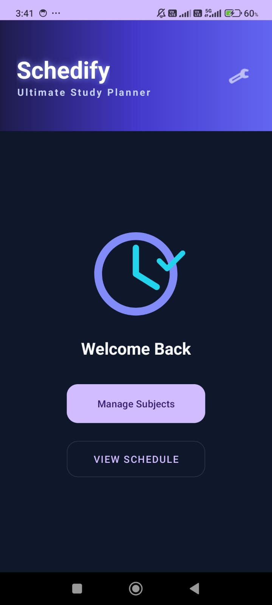
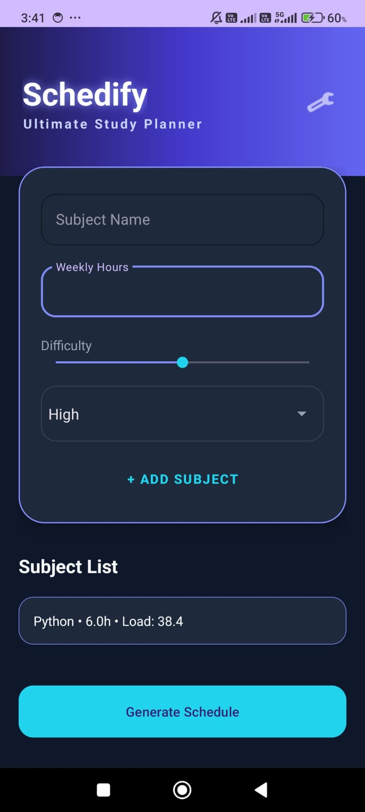
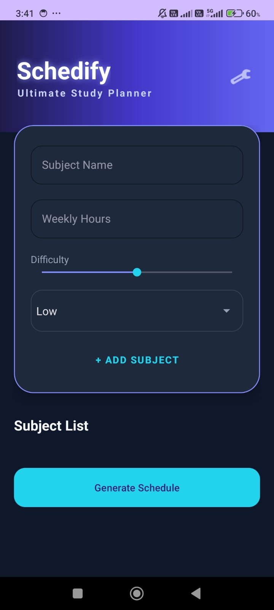
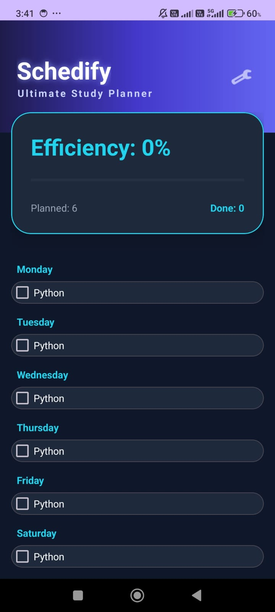
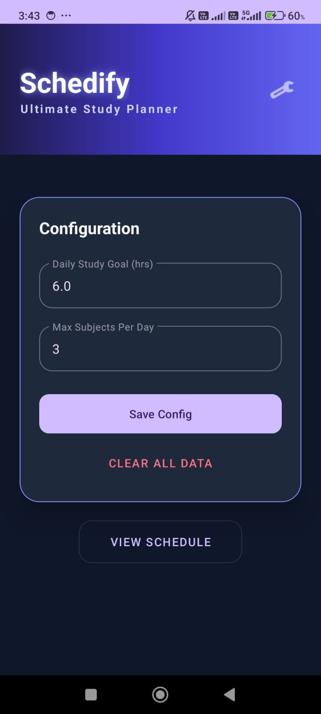

# Schedify – Smart Study Planner

  <b>A smart, constraint-based study planner that optimizes your schedule and boosts productivity </b>

  
  
  
  

## Screenshots

  
  
  

  
  

## Features

### Three-Tier Navigation
- **Home Screen** – Quick and clean entry point  
- **Subject Manager** – Add subjects with:
  - Weekly study hours  
  - Difficulty level (1–5)  
  - Priority (Low, Medium, High)  
- **Dynamic Dashboard** – Auto-generated weekly schedule  

### Smart Scheduling Algorithm
- Load = Weekly Hours × Difficulty × Priority Multiplier

**Priority Multipliers:**
- High → 1.6  
- Medium → 1.3  
- Low → 1.0  

### Constraint-Based Planning
- Daily Study Goal  
- Max Subjects Per Day  
- No repetition of same subject per day  

 Prevents burnout and improves consistency  

### Efficiency Tracking
- Efficiency (%) = (Completed Sessions / Total Sessions) × 100

- Real-time updates  
- Animated progress bar  
- Productivity feedback loop  

### Persistent Storage (SQLite)
- Subjects  
- Schedule  
- Completion status  
- User configurations  

### Modern UI – Dark Glow Theme
- Neon accents   
- Smooth animations   
- Clean and aesthetic interface  

## Installation

To install the app:

1. Click the link below  
2. Download the APK  
3. Install on your Android device  

 **Download Schedify**  
https://tinyurl.com/Schedify  

>  Enable **"Install from Unknown Sources"** in settings.

##  Tech Stack

| Category | Technology |
|--------|-----------|
| Language | Kotlin |
| Database | SQLite |
| UI | XML + Dynamic Views |
| Animations | ObjectAnimator, TransitionManager |
| Architecture | Modular Android |

##  How It Works

1. Add subjects with preferences  
2. Set study constraints  
3. Generate smart schedule  
4. Track daily progress  
5. Improve efficiency  

##  Use Cases

- Exam preparation  
- Time management  
- Productivity tracking  
- Student planning  

## Future Enhancements

- Graphs & analytics  
- Firebase sync  
- Smart reminders  
- AI-based planning  
- Pomodoro timer  

## License

This project is licensed under the MIT License.

## Author

**Prasanna T**

